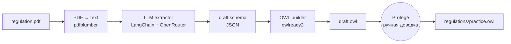
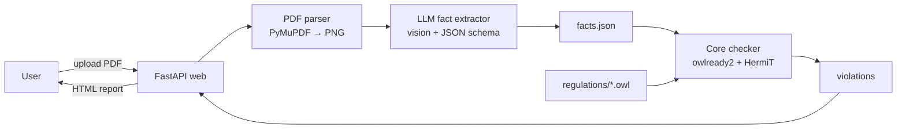

# Архитектура

## 1. Принципы

- **Два независимых пайплайна.** Build-time (медленный, ручной, один раз на регламент) и runtime (быстрый, автоматический, на каждый документ) разделены полностью. У них разные точки входа, разные зависимости, разные SLA.
- **Регламент — это плагин.** Ядро не знает про конкретный регламент. Оно умеет: загрузить `regulations/*.owl`, добавить факты как individuals, прогнать ризонер, собрать нарушения. Чтобы добавить новый регламент — кладём новый `.owl`.
- **LLM используется ровно в двух местах:** (a) build-time — извлечение черновика онтологии из текста регламента; (b) runtime — извлечение фактов из PDF приказа. Все остальные шаги детерминированы.
- **Источник истины — `.owl` файл.** Промежуточные JSON и черновики — расходный материал. Доводка делается в Protégé человеком, не LLM.

## 2. Высокоуровневая схема

### Build-time (один раз на регламент)



### Runtime (на каждый приказ)



## 3. Компоненты

### 3.1 `src/builder/` — Build-time pipeline

| Модуль | Ответственность |
|---|---|
| `pdf_to_text.py` | Конвертация PDF регламента в plain text через pdfplumber. Чистка артефактов (повторяющиеся колонтитулы, переносы) |
| `extractor.py` | LangChain-цепочка: prompt + Pydantic-схема ответа → структурированный JSON с классами/свойствами/правилами |
| `owl_writer.py` | Конвертация JSON → OWL через owlready2. Создание классов, свойств, и (в виде заготовок) SWRL-правил с TODO-комментариями |
| `__main__.py` | CLI: `python -m builder regulation.pdf -o draft.owl` |

**Точка входа:** `scripts/build_ontology.py` (тонкая обёртка над `python -m builder`).

### 3.2 `src/extractors/` — Runtime PDF parser

| Модуль | Ответственность |
|---|---|
| `pdf_render.py` | PyMuPDF: PDF → PNG-страницы (DPI 180) |
| `order_parser.py` | LLM-цепочка vision: PNG → структура приказа (header + students[]) по Pydantic-схеме |
| `models.py` | Pydantic-модели приказа (`Order`, `Student`, `PracticeLocation`, `Supervisor`) |

**Контракт на выходе** — `OrderFacts` (Pydantic), затем сериализуется в `facts.json`.

### 3.3 `src/core/` — Reasoner и отчёт

| Модуль | Ответственность |
|---|---|
| `loader.py` | Сканирует `regulations/*.owl`, грузит в один `World` owlready2 |
| `fact_injector.py` | Принимает `OrderFacts` → создаёт individuals в загруженной онтологии |
| `checker.py` | Запускает HermiT (`sync_reasoner_hermit`), вытаскивает инстансы класса `Violation` (или DL-эквивалент), формирует список нарушений |
| `report.py` | Формирует `CheckReport` (Pydantic): meta, students[], violations[], summary |

**Связь правил с нарушениями.** В онтологии каждое SWRL-правило заполняет свойство `violatesRule` у проблемного individual'а. `checker.py` собирает эти связи и обогащает их человекочитаемым текстом из аннотаций правил (`rdfs:comment`).

### 3.4 `src/web/` — FastAPI приложение

| Модуль | Ответственность |
|---|---|
| `main.py` | FastAPI app, маунт статики, маршруты |
| `routes.py` | `GET /` — форма; `POST /check` — приём PDF, запуск пайплайна; `GET /report/{id}` — рендер отчёта |
| `templates/` | Jinja2: `index.html`, `report.html`, `partials/` для HTMX |
| `static/` | CSS, минимум JS (только для HTMX-индикатора прогресса) |

**Состояние.** MVP без БД: отчёты складываются в `var/reports/{id}.json`, по `id` рендерится HTML. После рестарта остаются на диске.

### 3.5 `regulations/` — Плагинная папка регламентов

```
regulations/
└── practice.owl          # ФИТ НГУ методические рекомендации
```

Каждый файл — самодостаточная онтология с собственным namespace. Ядро объединяет их в общем `World` owlready2. При коллизии имён выбираются по namespace.

## 4. Потоки данных

### 4.1 Build-time (детально)

```
metod_rekomend_praktika.pdf
   ↓ pdfplumber
text/regulation.txt (~60 KB)
   ↓ chunk by sections (1.x, 2.x, 3.x)
   ↓ LangChain prompt (system + user) + Pydantic schema
   ↓ OpenRouter (deepseek/deepseek-chat-v3.1, temperature=0)
draft_schema.json {classes, object_properties, data_properties, rules[]}
   ↓ owlready2.OntologyWriter
draft.owl
   ↓ человек открывает в Protégé
   ↓ удаляет мусор, дописывает SWRL-правила
   ↓ сохраняет
regulations/practice.owl
```

### 4.2 Runtime (детально)

```
user uploads order.pdf
   ↓ web/routes.py: save → var/uploads/{id}.pdf
   ↓ extractors/pdf_render.py: PDF → PNG[10]
   ↓ extractors/order_parser.py: для каждой страницы — vision-LLM call
   ↓ объединение результатов → OrderFacts (Pydantic)
   ↓ var/facts/{id}.json
   ↓ core/loader.py: load regulations/*.owl
   ↓ core/fact_injector.py: создать Individual'ы по фактам
   ↓ core/checker.py: sync_reasoner_hermit() → violations[]
   ↓ core/report.py: CheckReport
   ↓ var/reports/{id}.json
   ↓ web/routes.py: redirect → /report/{id}
   ↓ render report.html
```

## 5. Структура каталогов

```
profi/onto/
├── docs/
│   ├── requirements.md
│   ├── architecture.md
│   ├── backlog.md
│   ├── sessions/
│   └── source/onto/
│       ├── metod_rekomend_praktika.pdf
│       ├── regulation.txt
│       └── Приказ_*.pdf
├── src/
│   ├── builder/
│   ├── extractors/
│   ├── core/
│   └── web/
├── regulations/
│   └── practice.owl
├── scripts/
│   └── build_ontology.py
├── tests/
├── var/                       # runtime data, в gitignore
│   ├── uploads/
│   ├── facts/
│   └── reports/
├── .env.example
├── .gitignore
├── pyproject.toml
└── README.md
```

## 6. Ключевые технические решения

### 6.1 Reasoner: HermiT (через owlready2)

owlready2 ставит HermiT и Pellet «из коробки». **Берём HermiT по умолчанию** — он стабильнее и быстрее для размеров нашей онтологии (~50 классов, ~100 individuals на приказ). Если SWRL-правила окажутся медленными — переключаемся на Pellet (`sync_reasoner_pellet`).

### 6.2 SWRL vs DL-аксиомы

Часть правил из R-01..R-10 проще выразить как **DL-class expressions** (например, R-09 «курс ∈ {1..4} для бакалавриата» — через `Restriction`), часть — как **SWRL** (R-04 с арифметикой над датами). Используем оба механизма: DL там, где можно, SWRL — где нужно вычисление.

### 6.3 LLM provider abstraction

В `src/builder/extractor.py` и `src/extractors/order_parser.py` модель задаётся через переменную окружения `LLM_MODEL` (по умолчанию `deepseek/deepseek-chat-v3.1`). Используем OpenAI-совместимый клиент (`openai` Python SDK) с `base_url=https://openrouter.ai/api/v1`. Замена провайдера = смена двух env-переменных.

### 6.4 Vision для приказа

Приказы сканированные. Берём страницу PNG → LLM-vision (например, `google/gemini-flash-1.5` через OpenRouter, бесплатно). На каждый PDF — N запросов (по странице). При 10 страницах — ~10 запросов на проверку. Кэш по SHA-256 хешу PNG (F-09 в SHOULD).

### 6.5 Идентификаторы запусков

`id` запуска — UUID4. Файлы на диске: `var/uploads/{id}.pdf`, `var/facts/{id}.json`, `var/reports/{id}.json`. Чистка — out of scope MVP.

## 7. Зависимости

| Пакет | Назначение |
|---|---|
| fastapi, uvicorn[standard], jinja2 | Веб-стек |
| python-multipart | Загрузка файлов в FastAPI |
| owlready2 | OWL + HermiT + SWRL |
| pymupdf | Рендер PDF в PNG |
| pdfplumber | Извлечение текста из текстовых PDF (регламент) |
| openai | Клиент для OpenRouter (OpenAI-совместимый) |
| langchain, langchain-openai | Промпт-шаблоны и structured output |
| pydantic | Схемы данных |
| python-dotenv | `.env` |

Линтер: `ruff`. Тесты: `pytest`. Тип-чекер: `mypy` (опционально для прототипа).

## 8. Не входит в архитектуру MVP

- Кэш парсинга (F-09) — добавим как декоратор в `extractors/`, но не в MVP
- БД отчётов (F-11) — пока файлы на диске
- Auth/роли — нет
- Worker queue (Celery/RQ) — выполняем синхронно в request handler, при необходимости заменяем на BackgroundTasks FastAPI
- Развёртывание — локально через `uvicorn`, никаких контейнеров для MVP
